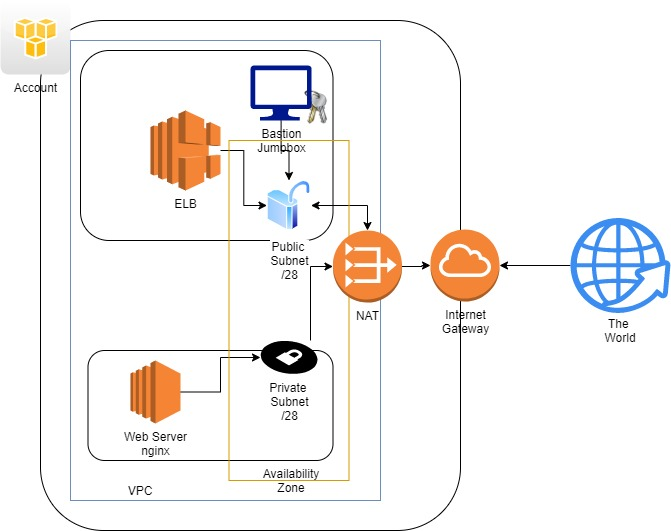

# Solution
El archivo de despliegue contiene las configuraciones para el despliegue a través de pipelines para la siguiente arquitectura



## Red
La configuración de red va sobre un conjunto limitado de ips en el VPC, ya que para optimizar los recursos, es necesario limitar para no tener direcciones de sobra, esto se tiene que ajustar cuando se agreguen reglas de autoescalado.

- Segmento /26 => 64  Direcciones IP
- Subred Publica /28 => 16 Direcciones
- Subres Privada /28 => 16 Direcciones

El enrutamiento incluye una Nat, Internet  Gateway y un conjunto de reglas para cada ambiente

- SG-NAT: habilita puertos 22, 80, 443, habilitando la funcion para saltos.
- SG-PUB: habilita puertos 80 y 443.
- SG-PRIV: habilita puertos 22 (Solo Jumpbox), 80 y 443 (Restringido para VPC)


## Administración de Instancia(s)
Para la administración, decidí utilizar un Jumpbox, ya que de esa forma no exponemos los puertos a nivel público, ya que se necesita de un servidor especial para hacer esta funcion.

Se uso una imagen especifica para la region EAST configurada para operaciones de Jumpbox (*Bastion*).

Se accede a través de la red publica al servidor y este funciona de jump para la o las instancias en la red privada.

La jumpbox recibe del proceso la inyección de la llave de administración y el archivo de contexto de nginx.


## Proceso
El proceso se encuentra semi autimatizado, la parte que se ejecutó de manera manual es el DSC o la preparación el EC2 para regresar la ip.

Los comandos que se encuentran en la sección DSC Script es lo que se ejecutó manualmente del proceso.

## Runtime
La ejecución se ejecutó a través de Azure DevOps/Local usando la extension Token Replacement, para evitar colocar datos sensibles de AWS en los archivos, la validación se ejecutó en entorno local y en la nube.


Se incluyen los logs de ejecución a travéz de Azure Pipelines en */logs/log*

## IAM, Key Pair
Se uso una entidad para _IAM_ y poder utilizarla en el proceso de despliegue, tiene las siguientes reglas habilitadas:
- VPCFullAccess
- EC2FullAccess
- S3FullAccess
- ElasticLoadBalancingFullAccess

Para _Key Pair_ se generó uno con el servicio de AWS y se descargo para el despliegue de las intancias y este mismo archivo es cargado al Jumpbox automáticamente. (Por seguridad no se incluyen aquí)

De esta manera tenemos control de que el rol unicamente hace o tiene acceso a lo que se supone para el proceso de despliegue y conexión. 

### DSC Script
```
    sudo apt-get update -y
    sudo apt-get install nginx
    sudo service nginx start
    sudo nano /etc/nginx/sites-available/showip
        _El contenido se encuentra en iac/showip.conf_
    sudo ln -s /etc/nginx/sites-available/showip /etc/nginx/sites-enabled/showip
    sudo rm /etc/nginx/sites-enabled/default
    sudo service nginx restart
```
